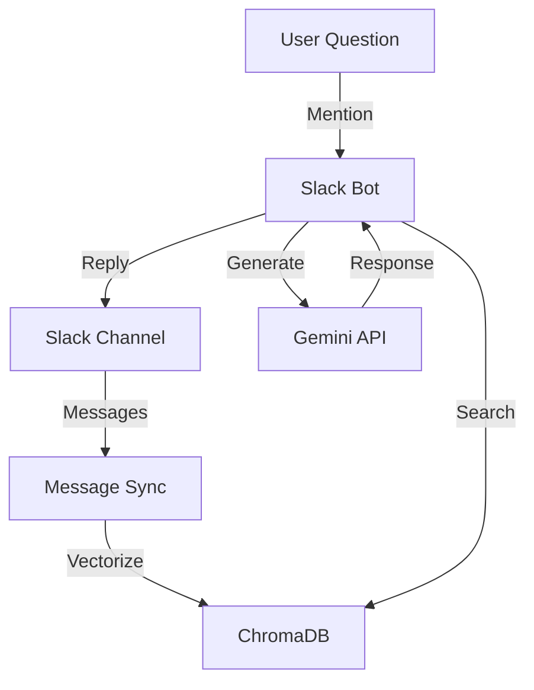

# Slack履歴を活用したRAGベースのAIアシスタントボットの開発

## はじめに

学校のプロジェクトやチーム活動において、過去の議論や決定事項を即座に参照することは重要です。しかし、Slackの検索機能だけでは、文脈を理解した上での情報検索は困難です。

そこで、チャンネルの履歴を学習し、自然な対話形式で情報を提供できるAIチャットボットを開発しました。このボットは、RAG（Retrieval-Augmented Generation）技術を活用し、過去のメッセージから関連情報を検索・提供します。

## 🎯 解決したい課題

1. **情報アクセスの効率化**
   - チャンネル内の過去の議論や決定事項への素早いアクセス
   - 文脈を考慮した関連情報の提供

2. **知識の共有と活用**
   - チーム内の暗黙知の可視化
   - 新メンバーの情報収集をサポート

## 🛠️ 技術スタック

- **言語とフレームワーク**
  - Python 3.10+
  - Slack Bolt Framework

- **AI/ML技術**
  - Google Gemini API（テキスト生成）
  - ChromaDB（ベクトルデータベース）
  - RAG（Retrieval-Augmented Generation）

- **インフラ**
  - Systemdサービス
  - 環境変数による設定管理

## 💡 主要機能

1. **メッセージの自動収集と保存**
   - 指定チャンネルのメッセージを自動収集
   - ベクトル化してChromaDBに保存

2. **コンテキストを考慮した応答生成**
   - メンションされた質問に対する関連メッセージの検索
   - Gemini APIによる自然な応答の生成

3. **情報源の提供**
   - 回答の根拠となったメッセージへのリンク
   - 信頼度スコアの表示

## 🔧 システム構成



## 📝 実装の詳細

### 1. メッセージの収集と保存

```python
async def sync_channel(self, channel_id: str):
    messages = self.slack_client.fetch_channel_history(channel_id)
    vectors = self.vectorizer.vectorize_messages(messages)
    self.vector_store.add_messages(vectors)
```

### 2. 質問応答システム

```python
def answer_question(self, question: str) -> tuple[str, List[dict]]:
    # 質問をベクトル化
    query_vector = self.vectorizer.vectorize_query(question)
    
    # 関連メッセージを検索
    relevant_messages = self.vector_store.search_similar(
        query_vector=query_vector,
        n_results=self.max_context_messages
    )
    
    # Geminiで回答を生成
    response = self.model.generate_content(
        self._construct_prompt(question, relevant_messages)
    )
    
    return response.text, relevant_messages
```

## 🚀 デプロイと運用

システムサービスとして実装し、自動起動と監視を実現：

```ini
[Unit]
Description=Slack AI Assistant Bot
After=network.target

[Service]
User=your-username
WorkingDirectory=/path/to/SlackAIBot
Environment=PATH=/path/to/venv/bin
ExecStart=/path/to/venv/bin/python src/main.py
Restart=always

[Install]
WantedBy=multi-user.target
```

## 📊 結果と効果

1. **情報アクセスの改善**
   - 質問から回答までの時間を大幅に短縮
   - 関連情報への直接リンクにより、文脈の理解が容易に

2. **チーム運営の効率化**
   - 新メンバーの情報収集時間の削減
   - チーム内知識の効率的な共有

## 🔜 今後の展開

1. **機能の拡張**
   - 画像認識機能の追加
   - 複数チャンネルの横断検索

2. **精度の向上**
   - 検索アルゴリズムの改善
   - プロンプトエンジニアリングの最適化

## 🔗 参考リンク

- [GitHub Repository](https://github.com/shahin99991/slack-ai-assistant)
- [Slack Bolt Python](https://slack.dev/bolt-python/concepts)
- [Google Gemini API](https://ai.google.dev/)
- [ChromaDB Documentation](https://docs.trychroma.com/)

## まとめ

RAGを活用したSlackボットの開発により、チーム内の情報アクセスと知識共有を効率化することができました。このプロジェクトを通じて、AIと既存のコミュニケーションツールを組み合わせることで、チームの生産性を向上させる可能性を示すことができました。

## ライセンス

このプロジェクトは[MITライセンス](https://github.com/shahin99991/slack-ai-assistant/blob/main/LICENSE)の下で公開されています。

- ✅ 商用利用可能
- ✅ 改変可能
- ✅ 再配布可能
- ✅ 私的利用可能
- ❌ 無保証
- ❌ 責任免除

コードやドキュメントの使用、改変、再配布は自由に行っていただけますが、著作権表示とライセンス表示を保持してください。
